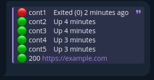

# Statuser

Statuser is a service that monitors the status of Docker containers and the availability of URLs using `systemd` timers.

## 📖 Table of Contents

- [📄 Description](#-description)
- [✨ Features](#-features)
- [🛠️ Technologies](#%EF%B8%8F-technologies)
- [📥 Installation and Setup](#-installation-and-setup)
- [📜 License](#-license)

## 📄 Description

Statuser is a CLI utility and background service designed to:

- Check if specified Docker containers are running.
- Ping configured URLs.
- Operate on a schedule using `systemd` timers.

## ✨ Features

- Periodic health checks using `systemd` timers
- Docker container state monitoring
- HTTP/HTTPS URL availability checks
- No external dependencies beyond Docker and systemd

## 🛠️ Technologies

- systemd timers and services

## 📥 Installation and Setup

1. Clone the repository:

```bash
git clone https://github.com/zefixed/statuser.git
cd statuser
```

2. Start install.sh and follow the instructions

```bash
sudo chmod +x ./install.sh
sudo ./install.sh
```

## 📤 Uninstallation and Cleanup

1. Start uninstall.sh

```bash
sudo chmod +x ./uninstall.sh
sudo ./uninstall.sh
```

## 📝 Example

```bash
zefixed@arch ~> git clone https://github.com/zefixed/statuser.git
zefixed@arch ~> cd statuser
zefixed@arch ~/statuser> sudo ./install.sh
Enter the names of the containers you want to track, separated by spaces (e.g. cont1 cont2 cont3): cont1 cont2 cont3 cont4 cont5
Enter the url you want to track, separated by spaces (e.g. https://example1.com https://example2.com): https://example.com
Enter the token of the bot that will send you notifications (you need to /start him by all accounts you specified in the last step): 1111111111:AAAAAAAAAAAAAAAAAAAAAAAAAAAAAAAAAAA
Enter the chat id (find out here t.me/getmyid_bot) you want to send notifications, separated by spaces (e.g. 1234567890 0987564321): 123456789
Enter the timeout after boot (e.g. 5m): 10m
Enter the timeout between checks (e.g. 5m): 10m
Created symlink '/etc/systemd/system/timers.target.wants/statuser.timer' → '/etc/systemd/system/statuser.timer'.
```

After installing and one of the services is unavailable, you will receive a notification like this in Telegram



## 📜 License

This project is licensed under the GNU License v3 - see the [LICENSE](LICENSE) file for details.
